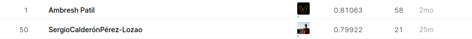

# Arvato Customer Segmentation

Capstone project for **Udacity Machine Learning Engineer Nanodegree**, which consists of the analysis of demographic data to rank leads by their propensity to become **Arvato Financial Solutions** customers, it includes a Kaggle competition.

# Installation

This project had been tested with python 3.6, so it's recommended to have an environment with this version of python to make it work.

As this package has `setup.py` aligned with `requirements.txt`, you only need to clone this repository and execute `pip install .` in the root of the project.

You can also do it the same way with command `make install`.

It's suggested to have an isolated environment activated before doing pip install (conda, venv, pipenv...).

# How To Run?

Once you have installed all of the requirements, you run the notebooks, first `Exploratory_Data_Analysis.ipynb` and then `Machine_Learning_Algorithms_For_Kaggle.ipynb`.

You need the data to run this repo, but it´s only available for **Udacity Machine Learning Engineer Nanodegree**, so sorry if you want to test it but for privacy reasons the data is not public.

For using only the best model you can run with mlflow. `load_best_model` is an alias from customer_segmentation module that helps you to get this model.

```python
from customer_segmentation import load_best_model


best_model = load_best_model()
```

This is very useful but it is very recommended to run the notebooks because if not it´s probably that you can´t realize in which format the model needs the data to be. 

# Makefile Shortcuts

You can get a data profiling with `make profile` and a new folder **reports** will be generated and the files will be saved there.

The testing part is not important if you do not modify any part of the software in this repository, so it will not be so useful but you can also launch `make test` to pass all the checks.

The last three shortcuts are for the generation of deliverables and style guide enforcement.

# Customer Segmentation Report

This project begins by using unsupervised learning methods to analyze attributes of established customers and the general population in order to create customer segments.

The first question in this project is: **"What makes customers and non-customers different through demographic data?"**.

# Supervised Learning Model

The previous analysis will be used to build a machine learning model that predicts whether or not each individual will respond to the campaign.

# Kaggle Competition

Once the model is chosen, it is also used to make predictions about the campaign data as part of a Kaggle competition: [Udacity+Arvato: Identify Customer Segments](https://www.kaggle.com/c/udacity-arvato-identify-customers/leaderboard). Individuals will be ranked by the probability of them becoming customers, and compared to other nanodegree students how it works.



# Project Rubrics

[Machine Learning Capstone project rubrics](https://review.udacity.com/#!/rubrics/2541/view)

# Documentation

Documentation is avalible [here](https://sergiocalde94.github.io/Arvato-Customer-Segmentation/), generated with Sphinx and GitHub Pages.
