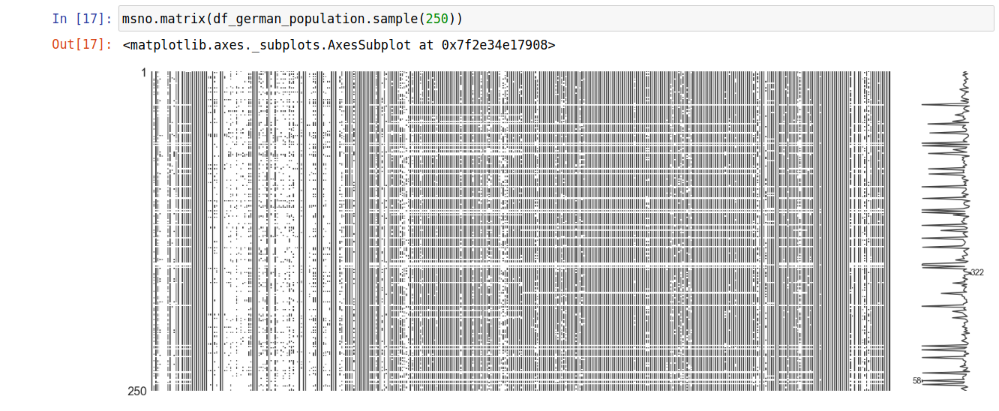
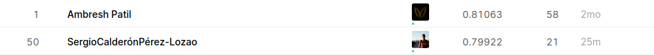

===================================================
Machine Learning Engineer Nanodegree Project Report
===================================================

**********************************************
Sergio Calderón Perez-Lozao - April 19th, 2020
**********************************************

|
|
|
|
|
|
|

.. contents::
.. raw:: latex

   \\clearpage

Definition
==========

Project Overview
----------------

The German company `Arvato Bertelsmann <https://www.bertelsmann.com/divisions/arvato/#st-1>`_ handles a lot of data and challenges us to use a small subset of it, which is public **demographic data to segment their customers**.

In addition, the company wants to know if, once this data has been analyzed and segmented, **it could be extrapolated to an application for the acquisition of new customers**.

Arvato also has the same information about these non-customers, since it is in the public domain. Therefore, it wants to check whether, with this data, it can be correctly classified as likely to become a new customer through different machine learning techniques, using supervised and unsupervised classification algorithms.

To carry out this task, the Udacity platform provides us with four data sets and two spreadsheets containing information on the attributes of the four other sets.

``Udacity_AZDIAS_052018.csv``\ : Demographics data for the general population of Germany; 891 211 persons (rows) x 366 features (columns)

``Udacity_CUSTOMERS_052018.csv``\ : Demographics data for customers of a mail-order company; 191 652 persons (rows) x 369 features (columns)

``Udacity_MAILOUT_052018_TRAIN.csv``\ : Demographics data for individuals who were targets of a marketing campaign; 42 982 persons (rows) x 367 (columns)

``Udacity_MAILOUT_052018_TEST.csv``\ : Demographics data for individuals who were targets of a marketing campaign; 42 833 persons (rows) x 366 (columns)

Problem Statement
-----------------

To solve this problem we are going to divide it in two big blocks, **analysis** and **machine learning**.

In the analysis part, we will make an analysis of **which features are worthy of being kept and which are not**\ , due to their high cardinality, nullity or being identification columns, for example.

This analysis will be performed with the data sets ``Udacity_AZDIAS_052018.csv`` and ``Udacity_CUSTOMERS_052018.csv``\ , which correspond to Arvato customers and a sample of the German population, as described above.

**We will confront these two sets to a supervised machine learning model of binary classification in which the target is to which set it belongs**\ , 1 if it is part of the clients and 0 if it is from the German population.

If this model has a poor AUC (0.5 would be the same as a random selection) it means that the problem is not separable and there is nothing that can be done with this data, but it results in a good AUC and even a good candidate for the Kaggle competition even if it is not trained with the same target.

If clients and non-clients can be well separated, it opens up three horizons for us to experiment:

* Using this data since the size is larger
* Use training data because they are the ones that provide us with the right target even if there is less sample
* Using both with the mixed target, we will have more sample and the effect of the training data provided will not be lost

These experiments will be carried out in the second part of the project, the one related to machine learning and Kaggle competition

Metrics
-------

For **unbalanced problems like this it is more advisable to use the PR AUC**\ , but as the metric they evaluate in the Kaggle, and therefore our objective, is the AUC, we will use this metric to evaluate the models.

This metric allows us to know **how well we rank the data**\ , in this case leads, and therefore a high AUC is translated into the business problem to be solved, **knowing who to direct the mailout campaigns to**.

Analysis
========

Data Exploration
----------------

First of all, we read a representative sample of the data, otherwise it is a pretty big data set and it will make us iterate slower.

..

   If there is no signal in the representative sample of the data, there will be no signal in the total data set.

To see how the data is, we draw a sample of this sample and see the huge amount of nulls that both datasets have:

As we know from the spreadsheets provided, most of the columns are categorical although most have a numerical code.

The different statistics do not make much sense because of the huge number of columns. Comparing each level of every categorical feature and checking that they have similar volume distributions is a tedious job and difficult to simplify. When doing this type of analysis on a dataset like this one it is more useful to implement a model and draw conclusions from its important variables and biases.

Exploratory Visualization
-------------------------

As we can see there are a lot of nulls at first sight, let's use the `missingno library <https://github.com/ResidentMario/missingno>`_\ , very useful for this kind of tasks.

Both follow similar patterns and we can also confirm that the datasets have many lost values. In the graphs above, black means that the value exists and white is a missing value. It is calculated on a sample of 250 rows of the total (already sampled, as we said before). To consider null values, some columns with values -1 and 0 are also included, as suggested in the spreadsheet explaining the variables (some of them).

For a better understanding, it is more useful to have a graph that simplifies the matrices above with the percentage of nulls that each column has, for each of the data sets. This is what is shown in the following graph, built with the `plotly_express library <https://github.com/plotly/plotly_express>`_.

It's ordered from the column with the most nulls in the customers to the one with the least. We can see that they are distributed practically the same, but that there are columns that have a different percentage of nulls, perhaps this can be a determining factor when segmenting.

As we already know from the spreadsheets provided, most of the columns are categorical although most have a numerical code.

The different statistics do not make much sense because of the huge number of columns. Comparing each level of every categorical feature and checking that they have similar volume distributions is a tedious job and difficult to simplify. When doing this type of analysis on a dataset like this one it is more useful to implement a model and draw conclusions from its important variables and biases.

Even so we have the profiling part where we have all these insights for each of the datasets and we can see which variables are more similar and which less.

Algorithms and Techniques
-------------------------

Regarding the algorithms, we will use two of the state-of-the-art algorithms for tabular data, `XGBoost <https://github.com/dmlc/xgboost>`_ and `CatBoost <https://github.com/catboost/catboost>`_\ , combined with the `sklearn pipeline <https://scikit-learn.org/stable/modules/generated/sklearn.pipeline.Pipeline.html>`_ that helps to embed the modeling and pre-processing of the data.

**We could also try GBM of H2O and LightGBM**\ , two very powerful gradient boosting too, plus the one of **H2O has the MOJO to make the model easily deployable**\ , but they have not been tested.

In addition to these algorithms, which will do the final task of assigning a probability of being prone to convert a client to each row, we will use unsupervised learning algorithms like `KMeans <https://scikit-learn.org/stable/modules/generated/sklearn.cluster.KMeans.html>`_ and different tools and techniques like `shap <https://github.com/slundberg/shap>`_ or `eli5 <https://github.com/TeamHG-Memex/eli5/>`_ to be able to interpret these black box models, very accurate but little explainable by themselves.

Here we can see the variables on which the first model we trained to make a prediction is most focused (trained with customer and German population data). The more red is higher the value of the variable and the more blue the opposite, the grey on the other hand are missing values or it is always present when dealing with categorical features since in this type of variables there is no order. The horizontal axis is the contribution of that variable to the model.

More simplified but without taking into account the sign of the contribution, we can see this other graphic, also from the brilliant shap library.

The downside is that we don't have the meaning of none of the top three variables (\ ``D19_SOZIALES``\ , ``AKT_DAT_KL`` and ``CJT_TYP_5``\ ) available. This would be unacceptable in a company, since data scientist must understand the business and its predictive models, but for this exercise we can turn a blind eye.

Now let's see how unsupervised learning techniques such as `PCA <https://scikit-learn.org/stable/modules/generated/sklearn.decomposition.PCA.html>`_ + KMeans might help to better segment the data set.

With only **four main components** we explain **95% of the variance** and on this **reduction of dimensionality** we will be able to apply a KMeans. Using the elbow method we choose an optimal 'k'.

As we can see, the groups are well differentiated and there is no overlap, although the size of the groups is not very similar. As we can see below, the groups do not discriminate differently between the test and train data, since the LIFT are the same in practically all the groups

Finally , the clustering did not help and the first model that differentiates between customers and the German population with all available variables works relatively well. CatBoost does an auto-imatic treatment of categorical variables and is very efficient.

These were the parameters of the first algorithm used and the score of its submission to Kaggle.

.. code-block:: python

   from catboost import CatBoostClassifier

   # Some preprocessing code
   params_catboost = dict(num_trees=30,
                          max_depth=3,
                          min_child_samples=25,
                          one_hot_max_size=4,
                          class_weights=class_weights,
                          cat_features=cat_features,
                          random_state=RANDOM_STATE,
                          eval_metric='AUC')

   CatBoostClassifier(**params_catboost)

Benchmark
---------

The reference point to beat is in the `kaggle leaderboard <https://www.kaggle.com/c/udacity-arvato-identify-customers/leaderboard>`_ and we can place it around the 0.78 that we have already achieved with the first submission.

The problem here is that the **leaderboard only corresponds to 30% of the test data**\ , so we may not really do as well (or as badly) as we thought from this ranking.

We have to work on implementing an algorithm that scores well on Kaggle but doesn't overfit in cross validation. In short, a more robust algorithm.

Methodology
===========

Data Preprocessing
------------------

For the preprocessing of the data, the information provided in the spreadsheets has been taken into account, so that all these values are considered as null values: '0, -1, 'X', 'XX']`.

In addition, it has been implemented in such a way that `pandas <https://github.com/pandas-dev/pandas>`_ reads the data with its ``category`` type that makes the use of categorical variables much more efficient in memory than the typical ``object`` type used by default.

The nulls have been filled in for the steps that required it, adding the category ``UNKNOWN`` to the columns with nulls, in case they were categorical variables. For the numeric columns, no null treatment has been done since both XGBoost and CatBoost work well with nulls and are able to see patterns in them (if any).

In some of the pipelines that have been implemented, a step has been used to make an oversampling of the data to the positive class, since in the train daots only 1% of the data has the target with this value.

Implementation
--------------

For the implementation of the different pipelines and their comparison the python module ``customer_segmentation`` has been developed (\ `link to documentation <https://sergiocalde94.github.io/Arvato-Customer-Segmentation/>`_\ ).

In this module we have four sub-modules:

* ``constants.py``
* ``experiment_tracking.py``
* ``helpers.py``
* ``models.py``

Constants
^^^^^^^^^

In this sub module we have all the project constants centralized, like for example ``RANDOM_STATE`` for the code reproducibility or also different ``PATH_*`` for the route management

Experiment Tracking
^^^^^^^^^^^^^^^^^^^

In this other sub-module we have the management of the experiments, performances and models orchestrated `MLFlow <https://github.com/mlflow/mlflow>`_.

Helpers
^^^^^^^

Here we have all the helpers of the project, such as ``read_demographic_data`` or ``kaggle_submission`` that facilitate tasks that are repeated over and over again and are general

Models
^^^^^^

Finally, in this sub-module there are all the functions referred to pre-processing of data for the models, calculation of metrics and persistence of models

When applying this module, the two notebooks ``Exploratory_Data_Analysis.ipynb`` and ``Machine_Learning_Algorithms_For_Kaggle.ipynb`` are used, clearly separated.

Refinement
----------

For the refinement and the different iterations between the models used, a tracking of the different experiments has been implemented with MLFlow:

* Using data from customers and the German population
* Using training data provided
* Using a mixture of the two approaches above

Customer and German population data
^^^^^^^^^^^^^^^^^^^^^^^^^^^^^^^^^^^

For this first section, the models trained in the first part of the project, corresponding to the first notebook, are used.

This experiment is made up of three models, one with all the variables, another with some less and finally, the one that uses the clustering explained above.

Training data provided
^^^^^^^^^^^^^^^^^^^^^^

Here the sample is smaller and we will iterate with different pipelines ending in XGBoost and CatBoost with oversampling and testing less variables, taking into account the importance of the variables of the models trained before.

Mixing the two types of data
^^^^^^^^^^^^^^^^^^^^^^^^^^^^

Finally, different modes will be trained, with approaches similar to the previous point but without oversampling, with all data together, to see if this can help improve the robustness and accuracy of the model.

Using MLFlow we can persist all these models and their metrics, parameters, etc and save the best one for direct reproducibility in a MLmodel file.

Results
=======

Model Evaluation and Validation
-------------------------------

The model that turns out to be the best according to the auc in test is an oversampling pipeline at twice the positive class, since if we balanced more it would perform much worse, and a CatBoostClassifier:

Best model parameters:

.. code-block:: python

   from imblearn.pipeline import make_pipeline
   from catboost import CatBoostClassifier
   from imblearn.over_sampling import RandomOverSampler

   # Some preprocessing code
   params_catboost = dict(
       num_trees=30,
       max_depth=3,
       min_child_samples=25,
       one_hot_max_size=4,
       cat_features=(
           set(cat_features)
           .intersection(feature_importances_catboost_oversampling_relevant)
       ),
       random_state=RANDOM_STATE,
       eval_metric='AUC',
       verbose=0
   )

   pipeline_catboost_oversampling_less_features = make_pipeline(
       RandomOverSampler(sampling_strategy=.02, random_state=RANDOM_STATE),
       CatBoostClassifier(**params_catboost)
   )

In order to validate it, a cross validation is made and the average of the preditions in the folds and their standard deviation is calculated. It seems to be a very robust model, so it ends up being the one chosen for the last submission and we reult in a good classification within Kaggle, only one point away from the best student.

.. code-block:: python

   # Dependencies code and preprocessing
   cross_val_score_catboost_oversampling_less_features = cross_val_score(
       pipeline_catboost_oversampling_less_features,
       X_train_catboost[feature_importances_catboost_oversampling_relevant],
       y_train,
       cv=StratifiedKFold(n_splits=4, shuffle=True, random_state=RANDOM_STATE),
       scoring='roc_auc',
       n_jobs=-1
   )

   print(f'{cross_val_score_catboost_oversampling_less_features.mean()}'
         f'±{cross_val_score_catboost_oversampling_less_features.std()}')

Justification
-------------

The obtained results are good, as we are only one point (and a couple of decimals) away from the best of the public leaderboard.

**This seems to be a good enough result**\ , besides that a very complete work has been done with different technologies and the objective of the project is fulfilled.

As future work there are several points that could be explored, like the algorithms mentioned above or for example a training with mixed data but weighing more strongly the records that belong to the training set provided.

Finally, a better understanding of the business could also be the key to improving the model obtained, but we have focused on being able to make all our work reproducible and easy to read for everyone else.

..

   Actionability is one of the most important parts of a model, as well as its interpretability
